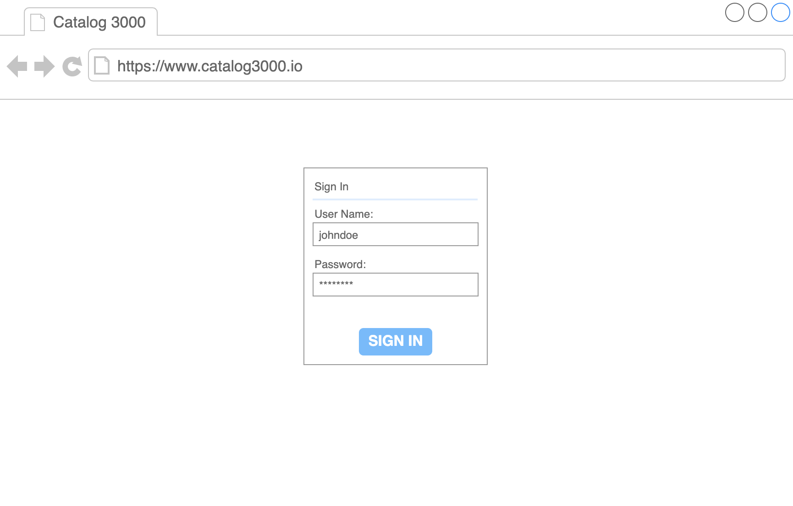
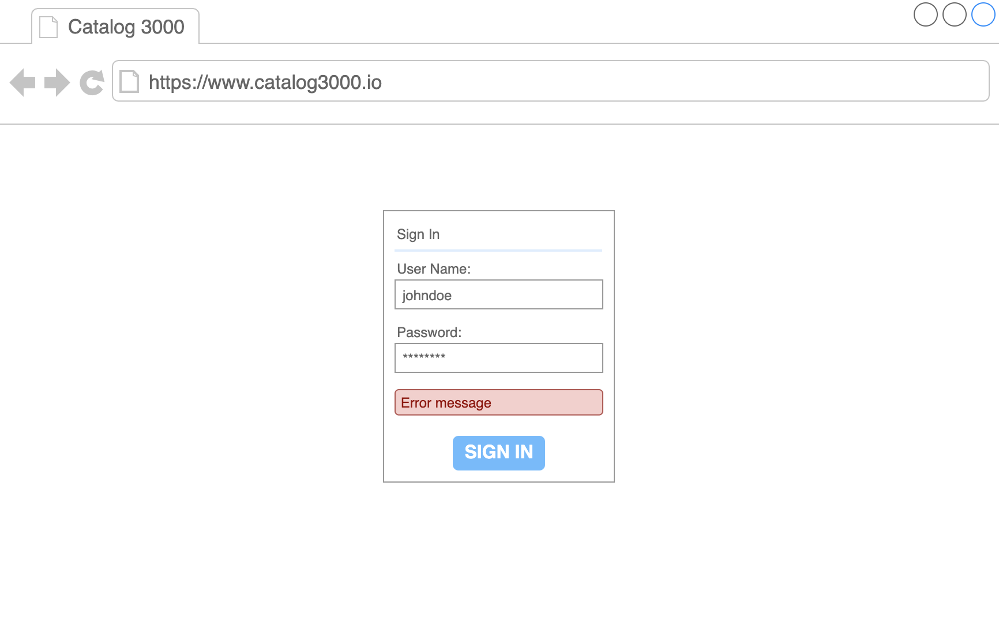
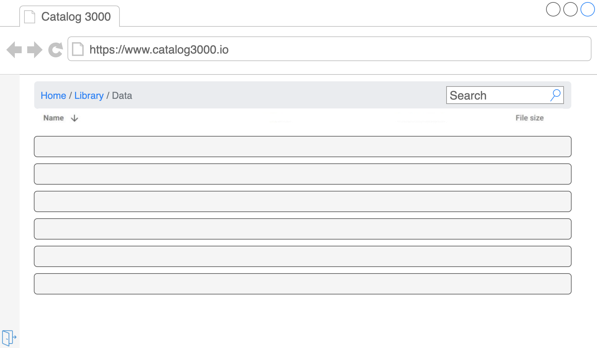
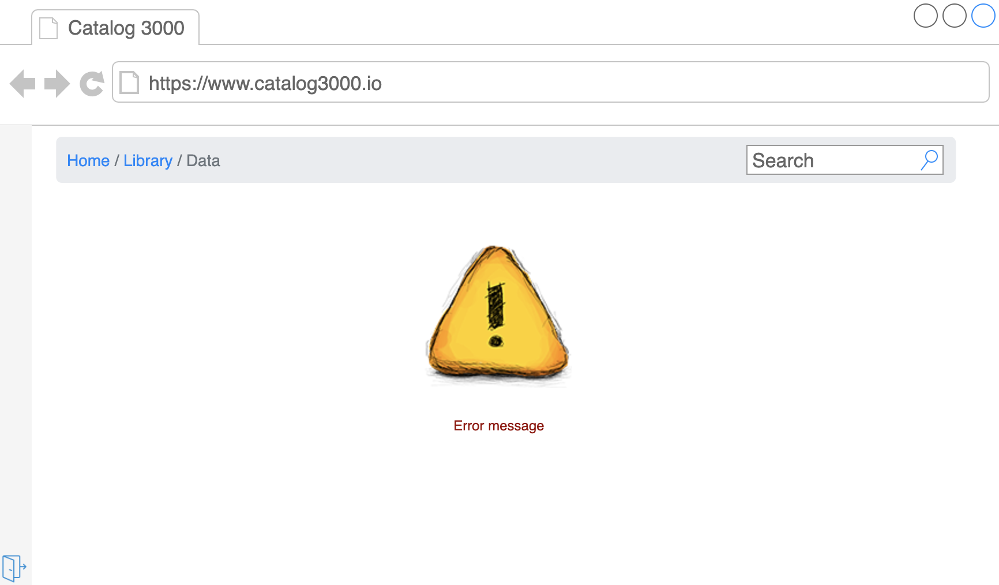

# Catalog3000

## Running

Generate self signed certificate:

The purpose of this project is to deliver improved experience of sharing files over internet. The most basic way of sharing directories is FTP server. Such a solution requires from users basic knowledge how filesystem works. SPA architect ure simplifies access for non tech savvy users. User friendly interface and custom features on top of filesystem make **Catalog 3000** unique and competitive on the market.

### Use cases

- As a data creator(professor at university) want to share class materials with my students.

- As a person who works on different devices / platforms I want to have easy access to my shared files.

- As a data owner want to be sure that my content is not exposed to not authorized parties.

- As a data owner want to be sure that private content on the server wont be exposed to end users.

- As a data owner want to have possibility to add new users tho the system. In the same time unwanted user should not be able to access **Catalog 3000** without my knowledge.

### Goals

- user friendly interface where users can browse directory content

- protect shared data from being exposed, stolen

- improve access to files through search and ordering

- share directory / file location with other users

### Non Goals

- being market leader

- role based access

- accessibility

- sharing single server instance between multiple data owners

- tracing user activities via logs

- data pagination / progressive rendering of directory content

- improving experience of uploading content

- mobile first approach

- securing content on system level(ACLs)

- offline experience

- Server Side Rendering

### Future Goals

- pre-fetching data

- cross browser support / RWD

- accessing or editing user profile data

## Tech stack

| Server                                       | Client                                                    |
| -------------------------------------------- | --------------------------------------------------------- |
| [nodejs](https://nodejs.org/en/)               | [Typescript](https://www.typescriptlang.org)              |
| [node alpine](https://hub.docker.com/_/node) | [HTML](https://developer.mozilla.org/en-US/docs/Web/HTML) |
| [Docker](https://www.docker.com/)            | [CSS](https://developer.mozilla.org/en-US/docs/Web/CSS)   |

### Project setup

Project is a monorepo managed by [Lerna](https://github.com/lerna/lerna) and [Yarn workspaces](https://classic.yarnpkg.com/en/docs/workspaces/).

```shell
packages
 - client
 - server
 - ui-toolkit
```

### Client

- dependencies
  - react
  - react-dom
  - react-router-dom
  - query-string
- dev tools
  - create-react-app
  - typescript
  - styled-components
  - eslint
  - prettier
  - react-testing-library
  - jest

### Server

- dependencies
  - node
  - jsonwebtoken
  - express
  - morgan
- dev tools
  - docker
  - typescript
  - nodemon
  - ts-node
  - eslint
  - prettier
  - jest

### ui-toolkit

- dependencies
  - react
  - react-dom
- dev tools
  - typescript
  - styled-components
  - eslint
  - prettier
  - react-testing-library
  - jest

## Solution

### Client

Single Page Application written in Typescript and React. Communication with server via HTTP protocol secured by TLS. Access to private content is protected. User can login into the system by providing generated `username` and `password`. Session is managed by `opaque` token attached to request `Authorization` header. Client stores token in `localStorage`.

`/auth`

Page presented for unauthenticated users. Simple HTML form placed in the center allows user to provide `username` and `password`.



Both fields are required, FE validates correctness of `username` with regex and presence of both fields. FE errors are presented directly on input fields, server error will be rendered below form.



By clicking `Submit` button user hits [login endpoint](). Authorized user is redirected to `/catalog/:path` view. Depending on URL state user will be presented with `root` or `:path` directory.

`/catalog/:path`

View where users browse directory content. Current location is encoded and saved in URL so user can refresh browser without loosing context. Breadcrumb at the top indicates current location, search gives possibility to filter items presented in the list(FE side filtering). Searched phrase is matched against all attributes with regex. Breadcrumb elements are interactive. User uses them to quickly navigate between different levels of directory. List header not only describes content in the columns but also allows to oder list(FE side ordering). User is allowed to use single column ordering at the time. Navigating through directories calls `/api/v1/file-browse/${path}`. User is not allowed to open file content.



Error and empty directory. In case of error list is replaced with error message. In case of empty directory list is replaced with no data message.



User can copy url and share it with colleagues. Unauthenticated user who tries to access catalog page will be redirected to `/login?redirect=encodeURIComponent(path)`. In case redirect `path` is invalid authorized user ends in `/`

Left navigation contains logout button, by clicking `logout` user hits [logout endpoint]()

#### CSRF (Cross-site request forgery)

- CSRF attack works because browser requests automatically include all cookies including session cookies. Custom header `Authorization: Bearer token`. `same-origin` policy ensures that `Authorization` header comes from our domain.
- forced login double cookie. Random value in `x-csrf-key` and `csrf-key` cookie. Server compares both values to detect attack.

#### XSS (Cross-site scripting)

- All DOM manipulation will be done using React.

- Protection from injecting malicious code will be provided by setting CSP. By default block everything and whitelist allowed resources when needed.

```txt
Content-Security-Policy: default-src 'none'; script-src 'self'; connect-src 'self'; img-src 'self'; style-src 'self'; frame-ancestors 'self'; form-action 'self';
```

#### Open redirect

- validate / sanitize redirect path

#### ReDoS (Regular Expression Denial of Service)

- not applicable, FE side fileting

#### Unit Tests

- search feature

- redirect unauthenticated user

- breadcrumb navigation

### Server

Simple and secure express server written in typescript. User data, session information are stored in file system. Shared content placed under `$CATALOG_ROOT`. Server exposes REST API and static files.

#### TLS (Transport Layer Security)

- Strict-Transport-Security header

- HTTPS server

#### XSS (Cross-site scripting)

- Content-Security-Policy header

- user cannot save data on server no risk of persistent XSS.

#### SSRF (Server-side request forgery)

- Sanitizing user input, do not allow retrieving URLs

#### Access control

- docker user:group, do not run server with admin rights

- validate catalog path in node to not expose content outside `$CATALOG_ROOT`

#### SQL(like) injection

- validate token

- sanitize user input

#### Password hashing

- password hashed with `scrypt` and stored in json file

- system does not use any other sensitive info. Techniques like authenticated encryption not applicable

#### `POST /api/v1/session`

Validates user credentials and returns `opaque` token. User accounts, secrets and tokens are stored in `users.json` file.

1. cryptographically secure random string is generated and hashed with RS256.

2. Token validation:

    - load user based on `opaque` token

    - take session secret

    - hash sessions secret

    - compare with authorization header

Request

```json
POST /api/v1/session HTTP/2
Content-Type: application/json

{
  "username": "username", // required
  "password": "secret_password" // required
}
```

Build docker image:

```bash
docker build -t catalog-3000:latest .
```

| status | code    | description |
| :----: | :-----: | ----------- |
| 403    | `4003`  | Invalid credentials

#### `DELETE /api/v1/session`

Removes `opaque` token form `users.json` file on server.

Request

```bash
docker run -p 8443:8443 catalog-3000:latest
```

## Developing

### Prerequisites

- npm - follow [instructions](https://docs.npmjs.com/downloading-and-installing-node-js-and-npm)

- nvm - follow [instructions](https://github.com/nvm-sh/nvm)

Retrieves current user based on `opaque` token.

### Running project in dev mode

```bash
  yarn install
  yarn start:dev
```

> self signed certificate is required

### Scripts

The following [npm scripts](https://docs.npmjs.com/misc/scripts) are made
available to you in the project root. You can run each of them with
`yarn run <script-name>`.

If you want to limit the scope of a script to a particular package, add the
`--scope` option to the command (e.g.,
`yarn run clean -- --scope=@catalog/client`). See [run options][].

#### clean

Retrieves shared content. `:path` argument will be resolved within `$CATALOG_ROOT`. Endpoint responds with dir info and its direct children. Programmatically secured relative paths `../../../a/b.txt`. Path parts are encoded `/api/v1/file-browser/encodeURIComponent('asd+asd.md')/encodeURIComponent('asd?asd.txt')` Invalid paths will be resolved with error.

Path validation code

```txt
export function basePath(path) {
  const resolvedPath = resolve(current directory, path);

  if (resolved path starts with ROOT_PATH) {
    return resolvedPath;
  }

  return ROOT_PATH;
}
```

#### build

_Supports [run options][]._

Runs the `build` scripts for each package.

#### start:dev

_Supports [run options][]._

Runs the `start:dev` scripts for each package.

#### lint

_Supports [run options][]._

Request

```json
GET /static/... HTTP/2
```

Response

```json
HTTP/2 200 OK
Content-Type: text/html | image/png | image/svg+xml | font/woff | font/ttf
```

#### `GET /`

Serves `index.html` file.

Request

```json
GET / HTTP/2
```

Response

```json
HTTP/2 200 OK
Content-Type: text/html
```

#### Tests

- unit tests for processing dir content

- unit tests for retrieving opaque tokens

## Limitations

- no role based access control

- no support for multiple devices login

- no way to change user password

- no way to trace user activity

## Data types

```typescript
interface User {
  id: string
  salt: string
  password: string
  username: string
}
```

```typescript
enum ErrorCode {
  1000 = 1000,
  4001 = 4001,
  4003 = 4003,
}
```

```typescript
interface ServerError {
  code: ErrorCode
  message: string
}
```

```typescript
enum Kind {
  FILE = 'file',
  DIRECTORY = 'dir',
}
```

```typescript
interface FileSystemNode {
  type: Kind;
  name: string;
  sizeKb: number;
  items?: FileSystemNode[];
}
```
